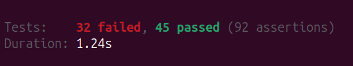

# Laravel Tests

### Come orientarsi nella scrittura dei test

---

## Unit o Feature Test?

By default, your application's tests directory contains two directories: Feature and Unit. Unit tests are tests that focus on a very small, isolated portion of your code. In fact, most unit tests probably focus on a single method. Tests within your "Unit" test directory do not boot your Laravel application and therefore are unable to access your application's database or other framework services.

Feature tests may test a larger portion of your code, including how several objects interact with each other or even a full HTTP request to a JSON endpoint. Generally, most of your tests should be feature tests.

##### https://laravel.com/docs/10.x/testing

---

## La documentazione

https://laravel.com/docs/11.x/testing

https://laravel.com/docs/11.x/http-tests

https://laravel.com/docs/11.x/database-testing

https://laravel.com/docs/11.x/filesystem#testing

https://laravel.com/docs/11.x/mail#testing-mailables

https://laravel.com/docs/11.x/queues#testing

---

## Il file di configurazione

Come sovrascrivere le variabili di ambiente

```
 <php>
        <env name="APP_ENV" value="testing"/>
        <env name="BCRYPT_ROUNDS" value="4"/>
        <env name="CACHE_DRIVER" value="array"/>
        <env name="DB_CONNECTION" value="sqlite"/>
        <env name="DB_DATABASE" value=":memory:"/>
        <env name="MAIL_MAILER" value="array"/>
        <env name="QUEUE_CONNECTION" value="sync"/>
        <env name="SESSION_DRIVER" value="array"/>
        <env name="TELESCOPE_ENABLED" value="false"/>
    </php>
```

https://docs.phpunit.de/en/12.0/configuration.html

---

## Php artisan, comandi utili

Creare i test:
`php artisan make:test UserTest`
`php artisan make:test UserTest --unit`
Lanciare i test:
`php artisan test`
`php artisan test path/toTheTest`
`php artisan test --filter methodName path/toTheTest`
`php artisan test --filter className`
Test coverage:
`php artisan test --coverage`
`XDEBUG_MODE=coverage php artisan test --coverage`


---

## BaseTest database tricks

##### Traits:

`use RefreshDatabase;`
`use DatabaseTransiction;`
`use DatabaseMigrations;`
`use DatabaseTruncation;`

##### Methods:

```
 // Run the DatabaseSeeder...
       $this->seed();

       // Run a specific seeder...
       $this->seed(OrderStatusSeeder::class);

       // ...

       // Run an array of specific seeders...
       $this->seed([
           OrderStatusSeeder::class,
           TransactionStatusSeeder::class,
           // ...
       ]);
```

---

## I Mock(sters)

When testing Laravel applications, you may wish to "mock" certain aspects of your application so they are not actually executed during a given test.

https://laravel.com/docs/11.x/mocking

https://docs.mockery.io/en/latest/getting_started/quick_reference.html

```
 protected function setUp()
    {
        parent::setUp();

        app()->bind(YourService::class, function() { // not a service provider but the target of service provider
            return new YourFakeService();
        });
    }
```

---

## Perchè utilizzare Pest

- Built-in **parallel** features for faster test runs
- Beautiful **documentation** that's easy to navigate
- Native **profiling** tools to optimize slow-running tests
- Out-of-the-box **Architectural Testing** to test application rules
- **Coverage** report directly on the terminal to track code coverage
- **Mutation Testing** to evaluate the quality of your test suite
- **Team Management** to manage tasks / todos with your team
- Dozens of **optional plugins**, such as Watch Mode and **Snapshot testing**, to

https://pestphp.com/
https://pestphp.com/docs/mutation-testing

---

## I test sui package. Caso studio: wm-package

## 

https://packages.tools/

https://packages.tools/testbench/troubleshooting.html#why-testbench-doesn-t-include-any-of-the-app-classes

---

## Credits

- [Marp CLI](https://github.com/marp-team/marp-cli)

---
